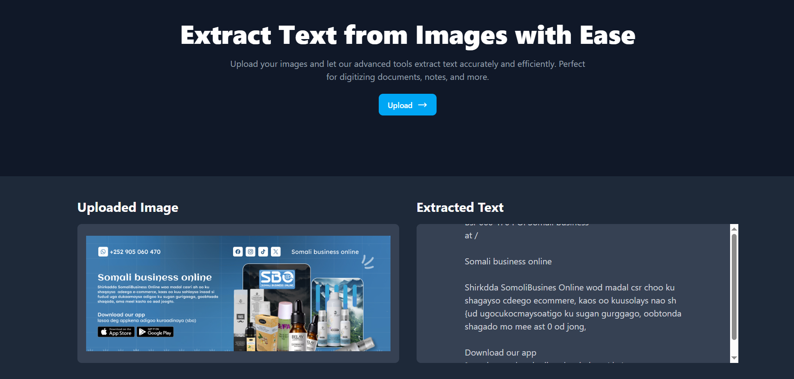

# ImageText - Extract Text from Images

ImageText is a web application that allows users to upload images and extract text from them using advanced OCR (Optical Character Recognition) technology. It is perfect for digitizing documents, notes, and other text-based content.

---

## Features

- Upload images and extract text with ease.
- Displays the uploaded image and extracted text side by side.
- Responsive design for a seamless user experience.
- Backend powered by Node.js and Express.
- Frontend built with React and Tailwind CSS.
- Uses Cloudinary for image hosting and Replicate API for OCR processing.

---

## Demo

## Demo




---

## Installation

### Prerequisites
- Node.js installed on your machine.
- A `.env` file with the following variables:
  ```env
  REPLICATE_API_TOKEN=your_replicate_api_token
  CLOUDINARY_CLOUD_NAME=your_cloudinary_cloud_name
  CLOUDINARY_API_KEY=your_cloudinary_api_key
  CLOUDINARY_API_SECRET=your_cloudinary_api_secret